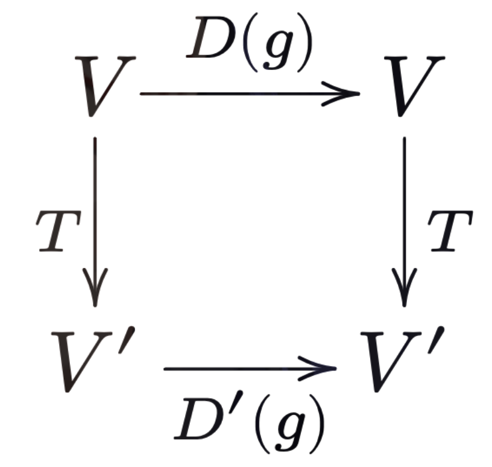

1. [群の表現](#群の表現)
   1. [一般線形群](#一般線形群)
   2. [表現](#表現)
   3. [繋絡作用素](#繋絡作用素)

# 群の表現

ここまで群の定義を見てきたが，群は条件を満たしさえすればどのようなものでも良い．そこで，例えばある"操作”を考えた時，2つの操作を続けて行うことを積と定義することで群を構成する．この群の構造を理解する際には，その操作を具体的に"表現"する必要がある．それこそが群の表現である．

ここで，話を抽象化させるとベクトル空間の中での線形変換として群を議論することに帰着する．

## 一般線形群

> ### 線形変換の定義
>
> $V$と$V'$を同じ体$\mathbb{K}$（例えば複素数全体の集合$\mathbb{C}$）の上のベクトル空間とする．今，任意のベクトル$\boldsymbol{x},\boldsymbol{y} ∈ V$および$a,b ∈ \mathbb{K}$に対し，
> $$
> \begin{equation*}
>   T(a\boldsymbol{x}+b\boldsymbol{y}) = aT(\boldsymbol{x}) + bT(\boldsymbol{y}) ∈ V'
> \end{equation*}
> $$
> を満たすような$T$を，$\mathbb{K}$上の**線形写像**(linear operator)や，**線形変換**(linear transformation)と呼ぶ．

以下，体は$\mathbb{C}$を考えるものとする．
 
任意の$\boldsymbol{x} ∈ V$は1次独立な$n$個のベクトル$\lbrace \boldsymbol{a_i} \rbrace_{i=1,\ldots,n}$の1次結合で表されるとするならば，
$$
\begin{equation*}
    \boldsymbol{x} = ∑_i x_i\boldsymbol{a_i}
\end{equation*}
$$
と書けるとする．今，線形変換によって基底は同じベクトル空間内のベクトルに変換される．従って，変換された基底$T(\boldsymbol{a_k})$はこの基底の1次結合で表されるから，
$$
\begin{equation*}
    T(\boldsymbol{a_k}) = ∑_i\boldsymbol{a_i}T_{ik}
\end{equation*}
$$
となる．1次結合の係数$T_{ik}$を行列要素とするような$n×n$行列を 線形変換変換$T$の変換行列と呼び，記号の乱用ではあるが同じ記号$T$で表す．

この変換によりベクトル$\boldsymbol{x}$は，
$$
\begin{align*}
    \boldsymbol{x}'
    &=∑_ix_i'\boldsymbol{a_i} \cr
    \boldsymbol{x}'&=T\boldsymbol{x} = T\left(∑_k x_k\boldsymbol{a_k}\right) = ∑_kx_kT(\boldsymbol{a_k}) = ∑_{i,k}\left(T_{ik}x_k\right)\boldsymbol{a_i}
\end{align*}
$$
と変換されるので，ベクトルの成分の間には，
$$
\begin{equation*}
    x_i' = ∑_k T_{ik}x_k \qquad (\boldsymbol{x}' = T\boldsymbol{x}の第i成分)
\end{equation*}
$$
という関係が成り立つ．逆変換$\boldsymbol{x} → \boldsymbol{x}'$を得るためには，$T$の逆行列$T^{-1}$を用いて，
$$
\begin{equation*}
    \boldsymbol{x} = T^{-1}\boldsymbol{x}'
\end{equation*}
$$
を求めれば良いが，そのための必要十分条件は$\det{T} ≠ 0$，つまり$T$が正則行列であることである．
 
$n$次正則行列の全体の集合は，行列の積，
$$
\begin{equation*}
    \left(AB\right)_{ik} = ∑_j A_{ij} B_{jk}
\end{equation*}
$$
に関して閉じている．さらに，単位行列を単位元に，逆行列を逆元に対応させれば，この集合は群を成す．これを**一般線形群**$\text{GL}(n,\mathbb{C})$と呼ぶ．改めて書くと，一般に$n ×n$行列の集合$M(n,\mathbb{C})$を用いて，
$$
\begin{equation*}
    \text{GL}(n,\mathbb{C}) = \left\lbrace g ∈ M(n,\mathbb{C}) \mid \det{g} ≠ 0\right\rbrace
\end{equation*}
$$

## 表現

> ### 群の表現の定義
>
> $G$を群とする．写像，
> $$
> \begin{equation*}
>   D:G → \text{GL}(n,\mathbb{C})
> \end{equation*}
> $$
> が与えられていて，任意の$a,b ∈ G$および単位元$e ∈ G$に対して，
>
> 1. $D(a)D(b) = D(ab)$
> 2. $D(e) = \text{id.} \qquad$（$\text{id.}$は恒等演算子）
>
> を満たすとき，$D$を群$G$の**表現**(representation)といい，$D$の作用するベクトル空間$V$を**表現空間**(representation space)という．表現空間を明示したい時は，$(D,V)$と書く．また，ベクトル空間の次元を$D$の次元と言い，$\dim{D}$と記す．
> $\dim{D} = ∞$のとき$D$は**無限次元表現**(infinite dimensional representation)と呼ばれる．
> $\dim{D} = n < ∞$のとき，表現は行列に対応しており，**行列表現**とも呼ぶ．

つまりは，群$G$の表現とは$G$から$\text{GL}(n,\mathbb{C})$の群準同型写像である．
 
一般に，群準同型写像であることを考慮すれば群の元と表現の対応は多対1である．例えば，群$G$の全ての元に，恒等演算子$\text{id.}$を対応させる写像を$G$の**恒等表現**(trivial representation)と呼ぶ．特に，群同型写像の場合は**忠実な表現**という．

## 繋絡作用素

> ### 繋絡作用素の定義
>
> $(D,V),(D',V')$をそれぞれ群$G$の表現とする．$g ∈ G$としたとき$V$から$V'$への線形写像$T$が，
> $$
> \begin{equation*}
>   D'(g)T = TD(g)
> \end{equation*}
> $$
> を満たすとき，$T$を$(D,V)$から$(D',V')$への**繋絡作用素**(intertwining operator)と呼ぶ．
>
> 言い換えれば，次の図式
>
> 

>
> が任意の$g ∈ G$に対して可換になるとき$T$を$(D,V)$から$(D',V')$への繋絡作用素と呼ぶ．

$(D,V)$から$(D',V')$への繋絡作用素全体の作る集合を，
$$
\begin{equation*}
    \text{Hom}_G(V,V'),\quad \text{Hom}_G(D,D')
\end{equation*}
$$
と書き，この集合もまたベクトル空間になる．
